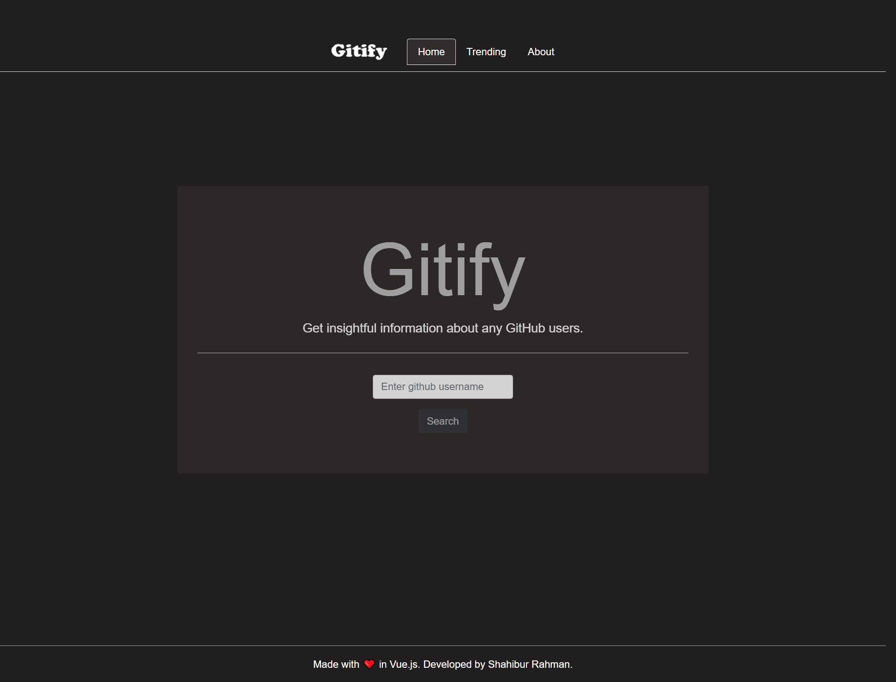
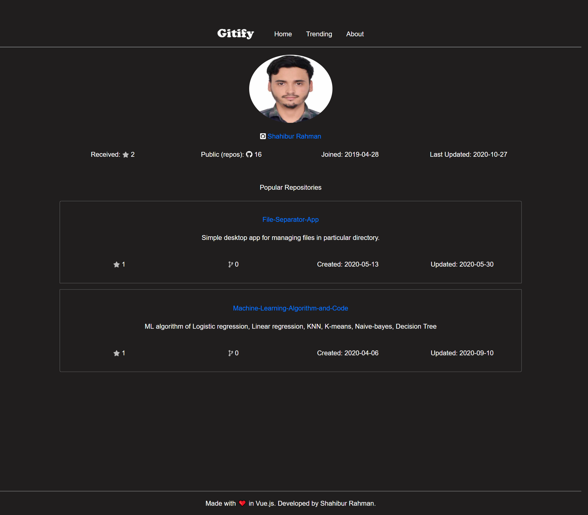

# Gitify
GitHub profile analyzer built with VueJs and JavaScript.

### Demo

Deployed on Netlify. <br>
Demo Link : <a href="https://gitify-demo.netlify.app/" target="_blank">here</a>

### ScreenShot
<table align="center">
    <tr>
        <td align="center">
         <p>Home Page</p>
        
        </td>
        <td align="center">
        <p>Profile Page</p>
         
        </td>
    </tr>
</table>

## Project setup
```
npm install

npm run serve

```

